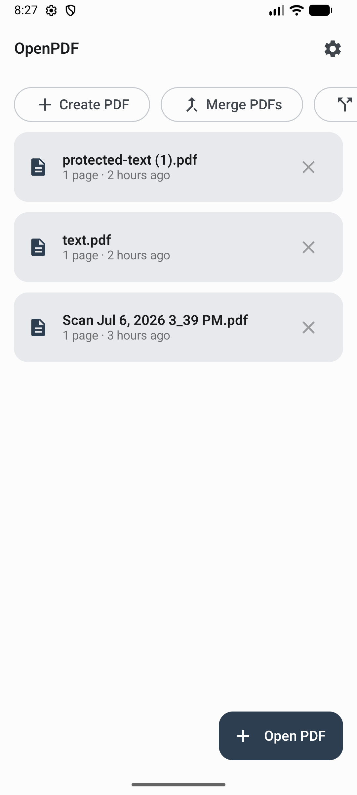
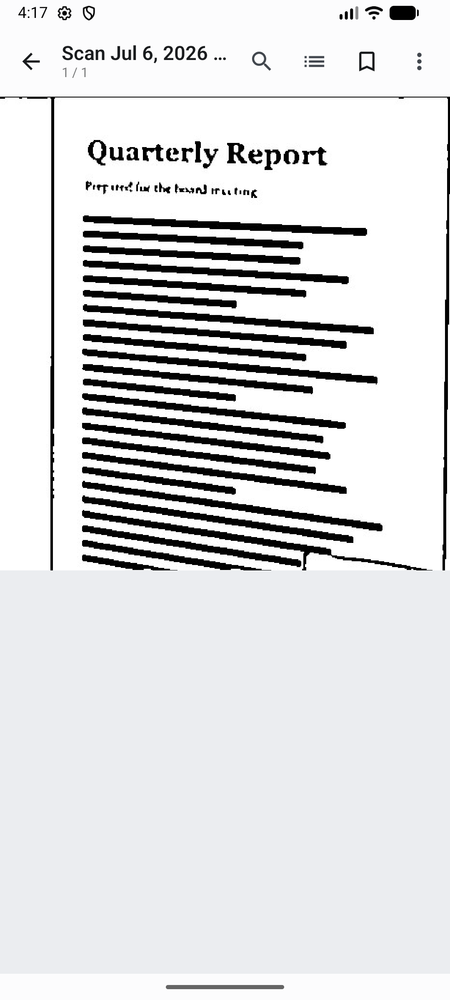
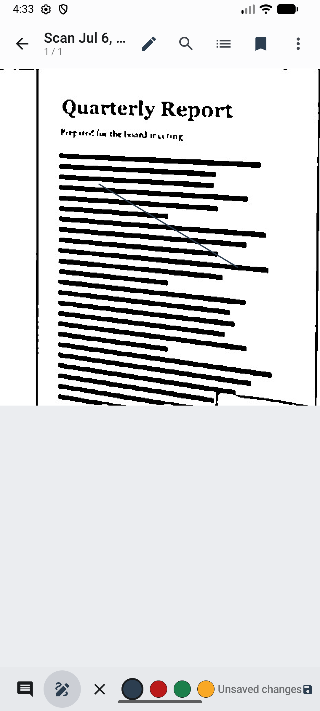

# OpenPDF

**A completely free, open-source PDF app for Android.** View, annotate, fill & sign, organize, create, and protect PDFs — with no ads, no subscriptions, no accounts, and **no internet access at all**. Everything happens on your device.

OpenPDF is a full alternative to proprietary PDF readers, including the features they usually lock behind a subscription.

[](https://github.com/TonmoyBishwas/foss.openpdf.app/actions/workflows/ci.yml)
[](LICENSE)
[](https://github.com/TonmoyBishwas/foss.openpdf.app/releases/latest)

## Download

Grab the latest APK from the [**Releases**](https://github.com/TonmoyBishwas/foss.openpdf.app/releases/latest) page. If you're not sure which to pick, use `OpenPDF-vX.Y.Z.apk` (the universal build) — the per-ABI APKs are smaller downloads for a specific device.

## Features

- **View** — fast rendering, pinch & double-tap zoom, continuous scroll and page-by-page modes, night & sepia reading modes, keep-screen-on
- **Navigate** — table of contents, bookmarks, go-to-page, full-text search with highlights
- **Listen** — read aloud with on-device text-to-speech
- **Annotate** (saved into the PDF) — highlight, underline, strikethrough, sticky notes, freehand drawing, text boxes, shapes, and an eraser
- **Fill & sign** — fill interactive form fields; draw a signature and place it anywhere
- **Organize** — rotate, reorder, duplicate, delete, and extract pages; merge and split PDFs
- **Create** — make PDFs from images, camera scans (with a black & white filter), or typed text
- **Protect** — add or remove an AES-256 password; view and edit document metadata
- **Share & print**

## Privacy

OpenPDF requests **no internet permission** — it is technically incapable of sending your documents anywhere. No analytics, no telemetry, no accounts. It only opens files you explicitly pick, and only writes where you tell it to. See the [privacy policy](https://tonmoybishwas.github.io/foss.openpdf.app/privacy-policy.html).

## Screenshots

| Home | Viewer | Annotate |
|---|---|---|
|  |  |  |

## Building

Requirements: JDK 17+ and the Android SDK (compileSdk 36).

```
./gradlew assembleDebug        # debug APKs (per-ABI + universal)
./gradlew assembleRelease      # signed release APKs (needs signing env vars)
./gradlew bundleRelease        # AAB for Play
./gradlew testDebugUnitTest    # unit tests
```

Release signing reads these environment variables (falls back to the debug key when unset): `OPENPDF_KEYSTORE`, `OPENPDF_KEYSTORE_PASSWORD`, `OPENPDF_KEY_ALIAS`, `OPENPDF_KEY_PASSWORD`.

## Tech

Kotlin · Jetpack Compose · Material 3 · single-activity · Hilt · Room · DataStore.
PDF engine: [MuPDF](https://mupdf.com/) (AGPL-3.0) for rendering and editing;
[PdfBox-Android](https://github.com/TomRoush/PdfBox-Android) (Apache-2.0) for creation.

## License

[GPL-3.0-or-later](LICENSE). OpenPDF bundles MuPDF (AGPL-3.0); the combined work is distributed under terms compatible with both. Full component notices are in the app's Settings → About → Open-source licenses.
